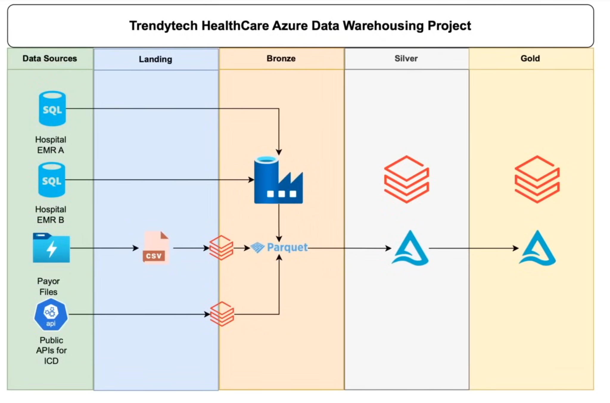
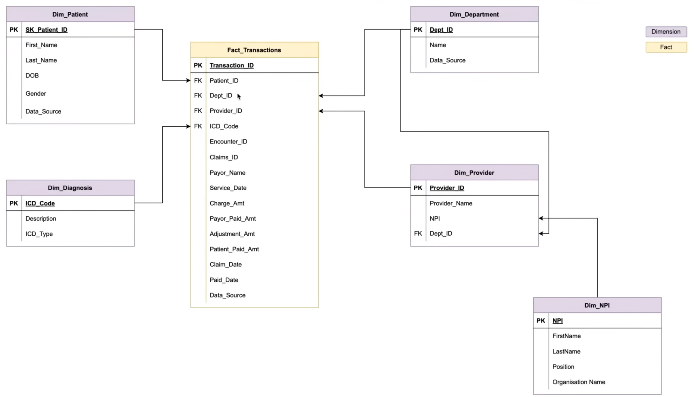

# 🏥 Healthcare Revenue Cycle Management (RCM) Data Platform

## Overview
Built an end-to-end Azure Data Engineering solution to process healthcare financial data from multiple sources.

## Tech Stack
- Azure Data Factory (ETL orchestration)
- Azure Databricks (data processing)
- ADLS Gen2 (storage)
- Delta Lake (data reliability)

## Medallion Architecture
Landing → Bronze → Silver → Gold

## Data Sources
- EMR Data (Azure SQL DB)
- Claims CSV Files (ADLS)
- APIs (NPI, ICD)

## Key Features
- Config-driven ingestion pipelines
- Incremental & full load support
- SCD Type 2 implementation
- Data quality checks with quarantine logic

## Project Structure
- `adf/` → pipeline screenshots & configs
- `databricks/` → notebooks (bronze, silver, gold)
- `configs/` → ingestion config
- `docs/` → architecture details

## ADF Pipeline
See `/adf/screenshots`

## Architecture Diagram

## Data Model (Star Schema)

## 🔄 Azure Data Factory Pipelines

ADF is used for orchestration of ingestion and transformation workflows.

- Config-driven pipelines using Lookup + ForEach
- Supports full and incremental loads
- Modular pipeline design using Execute Pipeline
- Integrated with Databricks for transformations

See detailed pipeline flow in `adf/README.md`

---

