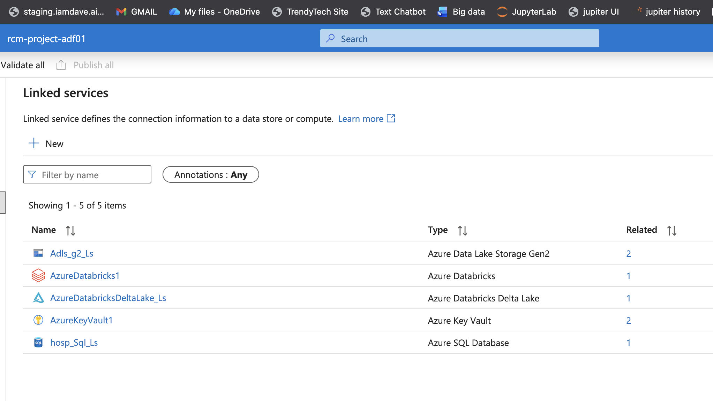
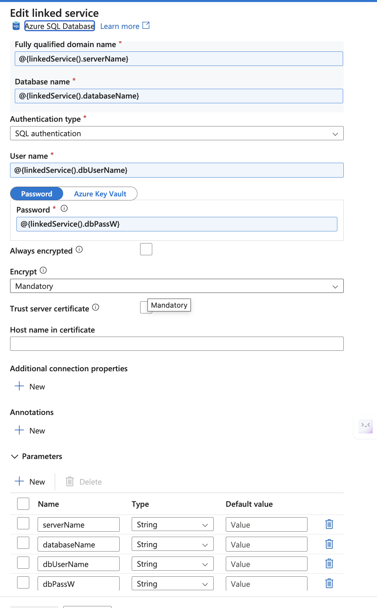
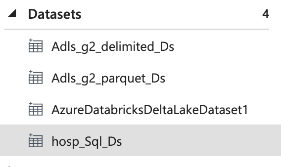
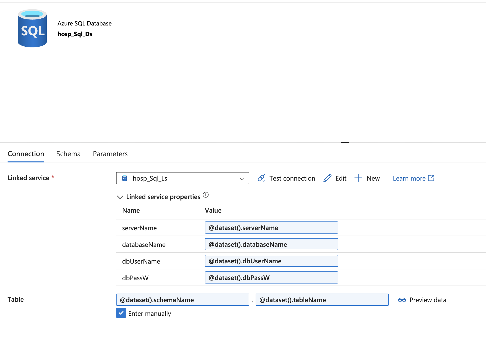
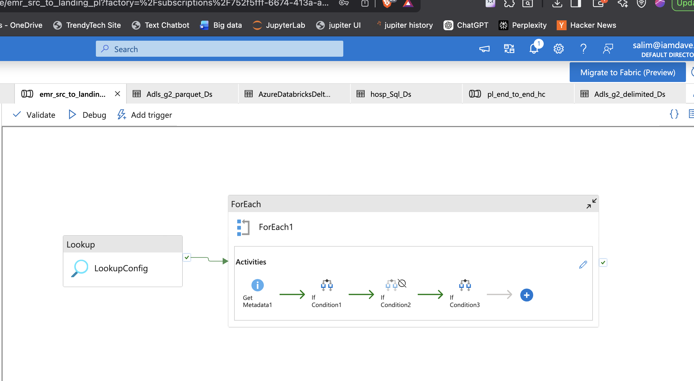
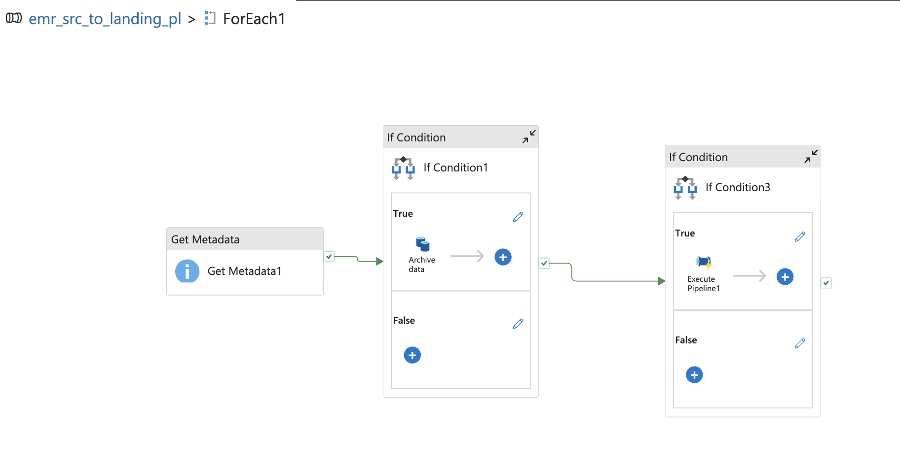
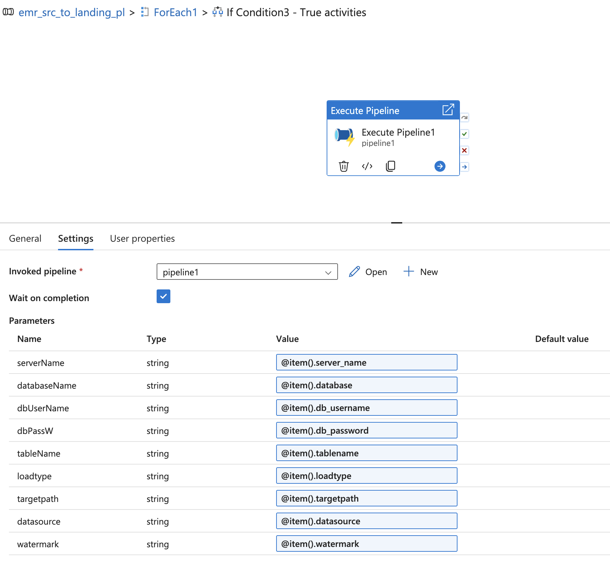
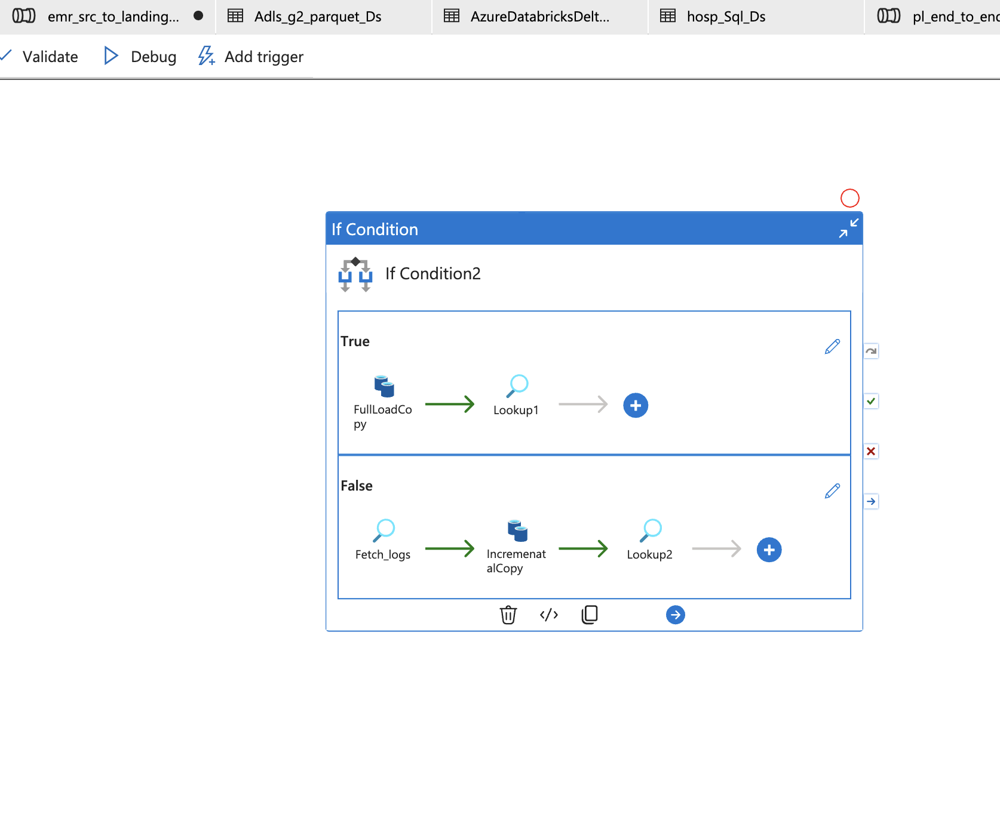
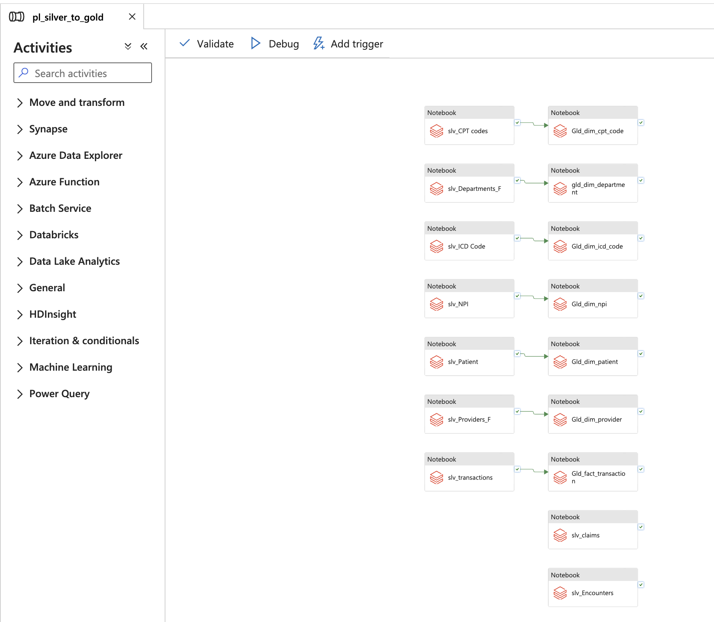
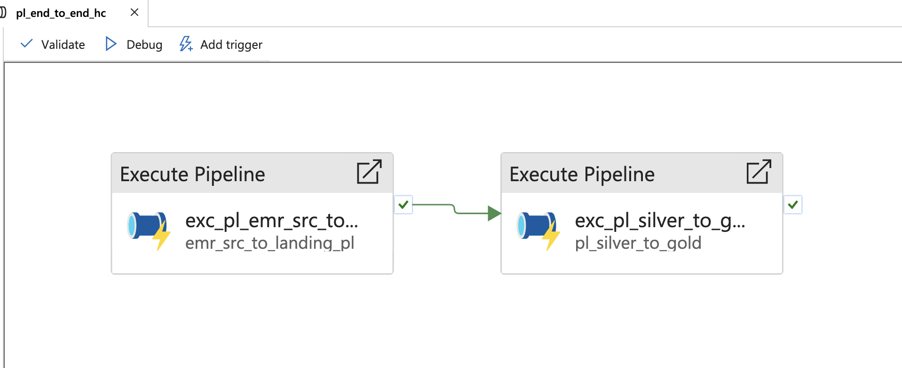

# 🔄 Azure Data Factory (ADF) Pipelines

This project uses Azure Data Factory (ADF) to orchestrate end-to-end data ingestion and transformation workflows for the Healthcare RCM platform.

---

## 📌 Overview

ADF acts as the **orchestration layer**, responsible for:

* Ingesting data from multiple sources
* Managing dependencies
* Triggering Databricks notebooks
* Enabling scalable, config-driven pipelines

---

## ⚙️ Pipeline Design

The pipelines follow a **config-driven architecture**, allowing dynamic execution for multiple datasets and hospitals without hardcoding logic.

---

## 🔑 Key Components

### 1. Linked Services

* Azure SQL Database (EMR data)
* ADLS Gen2 (storage)
* Azure Databricks
* Azure Key Vault (secrets)

📸

---

### 2. Parameterized Linked Services

* Enables dynamic connection handling
* Supports multiple hospital data sources

📸

---

### 3. Datasets

* SQL datasets for EMR tables
* ADLS datasets for file storage
* Parameterized datasets for reusability

📸

📸

---

## 🔄 Pipeline Flow

### 4. Source → Landing Pipeline

* Extracts data from source systems
* Loads into ADLS (Landing/Bronze)

📸

---

### 5. ForEach Loop (Dynamic Execution)

* Iterates over config-driven table list
* Enables scalable ingestion

📸

---

### 6. Execute Pipeline Activity

* Calls child pipelines dynamically
* Separates logic for modular design

📸

---

### 7. Copy Activity (Core Ingestion Logic)

* Handles both:

  * Full load
  * Incremental load (watermark-based)

📸

---

### 8. Silver & Gold Execution

* Triggers Databricks notebooks
* Processes Bronze → Silver → Gold transformations

📸

---

### 9. Main Orchestration Pipeline

* Entry point for full workflow
* Coordinates ingestion + transformation

📸

---

## 💡 Key Highlights

* Config-driven ingestion using Lookup + ForEach
* Incremental loading using watermark strategy
* Modular pipeline design using Execute Pipeline
* Integration with Databricks for transformations
* Secure credential handling via Key Vault

---

## ✅ Summary

ADF serves as the backbone of the pipeline, enabling:

* Automation
* Scalability
* Reusability
* Maintainability
